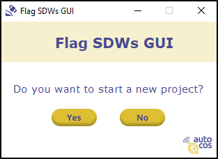

# Flag-SDWs-GUI

This repository contains the GUI software developed to identify instances where a Satellite-Derived Waterline (SDW) is unable to accurately detect the land-water interface, whether partially or fully. The main objective is to label, within a preestablished options, which indicator the SDW is actually detecting. To do so, the present GUI facilitates the visualization of each SDW with its satellite image smoothly. Finally, the results are saved as a CSV file for further analysis.

## How to run the program?
**1. Install dependencies...**

  a) by creating new Anaconda environment:
  ``` bash
  conda env create --file environment.yml
  conda activate flag_sdw_gui
  ```
  b) directly from the requirements.txt file:
  ``` bash
  pip install -r requirements.txt
  ```
**2. Run the [main.py](https://github.com/IHCantabria/Flag-SDWs-GUI/tree/main/build/main.py) script located in the [build](https://github.com/IHCantabria/Flag-SDWs-GUI/tree/main/build) subfolder**
``` bash
python main.py
```
## Usage
The application is divided into 3 window frames, which are described below:

1. The user is asked whether to start a new project. If "No" button is clicked, the user is prompted to enter a TXT file (**"input_files/input_info.txt"**) which is created in the next window and is stored in the **output folder**.
<div align="center">
  <a href="https://github.com/AlbertGallegoJimenez/Flag-SDWs-GUI">
    
  </a>
</div>

2. Initialize a project by passing input data. When "Start" button is clicked, the output folder (with the format "output_folder_" + current datetime) is created in the [build](https://github.com/IHCantabria/Flag-SDWs-GUI/tree/main/build) subfolder with a text file where the previous input is saved. In addition, the output CSV file where the results are collected is saved as **"flag_sdw_output.csv"**.
> [!WARNING]
> - RGB TIF file names must be stored in the ``YYYY-MM-DD-sensor`` format, e.g.: "2021-10-28-S2`.tif".
> - Make sure that the Feature Class names you pass are actually in the File GDB.
> - The metocean time series file must have, at least, a column named ``date`` in ISO format; ``hs`` expressing the significant wave height in meters; and ``tide`` expressing the astronomical tide in meters.

<div align="center">
  <a href="https://github.com/AlbertGallegoJimenez/Flag-SDWs-GUI">
    
  </a>
</div>

3. First, the user selects a SDW from the "Select a SDW" drop-down menu and clicks the "Plot" button to display the SDW and metocean data and visualize a map with the satellite image and SDW in the browser. The user then selects the transects in which the SDW does not represent the water-land interface, specifying it by selecting a predefined option and expressing the confidence level of the attribution. Before moving on to the next SDW, the user clicks the "SAVE SDW" button where the results are exported to the **flag_sdw_output.csv**.

<div align="center">
  <a href="https://github.com/AlbertGallegoJimenez/Flag-SDWs-GUI">
    
  </a>
</div>

<div align="center">
  <a href="https://github.com/AlbertGallegoJimenez/Flag-SDWs-GUI">
    
  </a>
</div>

## Contact
For code-development issues contact 👨‍💻[Albert Gallego](gallegoa@unican.es).
</br>
</br>
<div align="center">
  <a href="https://github.com/AlbertGallegoJimenez/Flag-SDWs-GUI">
    
    </br>
    </br>
    
  </a>
</div>
